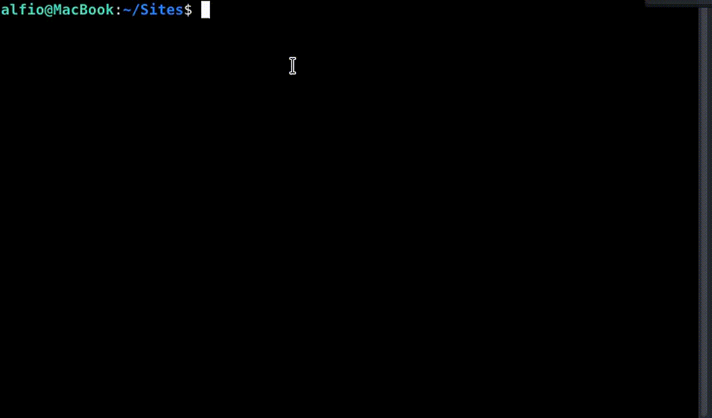
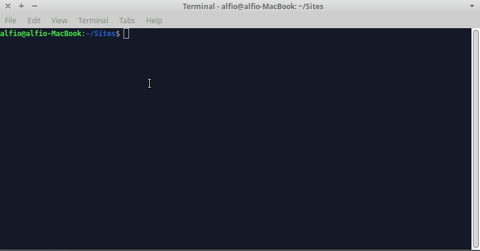

# NAME
	lamp_virtual_host - create or delete an apache virtual host with database mysql

# DESCRIPTION
lamp_virtual_host is a simple bash script for debian machines that create or delete an apache virtual host
	
It's possible create or delete a database mysql and choose a different php-fpm version

# INSTALLATION
`sudo mv lamp_virtual_host /usr/local/bin`

`sudo chmod +x /usr/local/bin/lamp_virtual_host`

# USAGE
## Create the virtual host

## Delete the virtual host

# REQUIREMENTS
- A debian linux distribution like Ubuntu
- Stack Lamp: Apache, Mysql (optional), Php
- php-fpm module (optional)
- mkcert for ssl certificate
       
# AUTHOR: 
lamp_virtual_host is written by Alfio Salanitri www.alfiosalanitri.it and are licensed under the terms of the GNU General Public License, version 2 or higher. 
