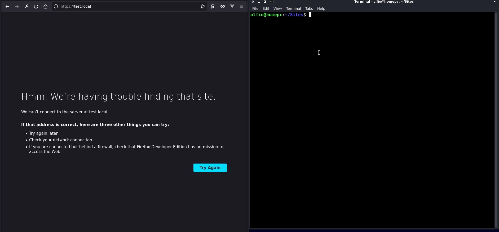

# NAME
***lamp_virtual_host** - create or delete an apache virtual host with database mysql support, custom fast-cgi php version and 
ssl certificate*

# DESCRIPTION
With lamp_virtual_host bash script you can add/delete an apache virtual host to/from your LAMP stack. You can also to add a database with custom user associated and choose one of yours fast-cgi php module if installed.

If you choose development environment option, the script will add the ssl certificate with mkcert package if installed on your machine.
If you choose production environment, the script will add the ssl certificate with certbot and let's encrypt. Note that this step requires the dns for domain and aliases setted to your server ip address before run the script.

You can also choose if auto install Wordpress or Laravel application in your virtual host. (see demo gif)

# INSTALLATION
`cd /home/your-user/your-directory`
`git clone https://github.com/alfiosalanitri/lamp-virtual-host.git`
`sudo chmod +x /home/your-user/your-directory/lamp-virtual-host/lamp_virtual_host`
`sudo ln -s /home/your-user/your-directory/lamp-virtual-host/lamp_virtual_host /usr/local/bin/lamp_virtual_host`

# USAGE

# REQUIREMENTS
- Debian Linux distribution like Ubuntu or Debian
- Stack Lamp: Apache, Mysql (optional), Php
- php-fpm module (optional)
- mkcert or certbot for ssl certificate (optional)
- wget, tar, unzip and composer for application installation (optional)

# Applications which may be installed
- Wordpress
- Prestashop
- Laravel
       
# AUTHOR: 
lamp_virtual_host is written by Alfio Salanitri www.alfiosalanitri.it and are licensed under the terms of the GNU General Public License, version 2 or higher. 
